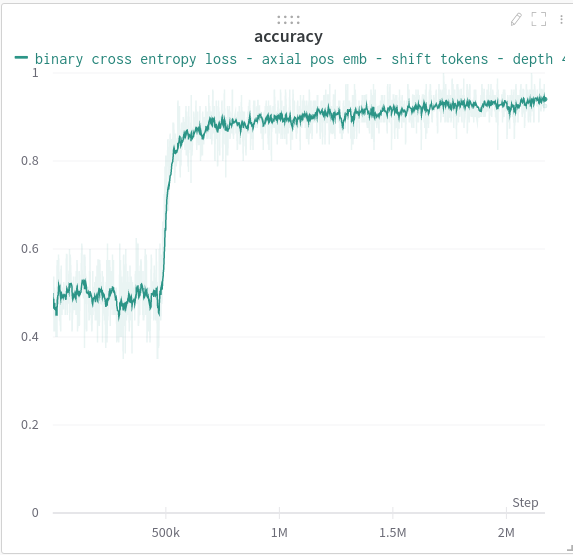

## Panoptic Transformer (wip)

Another attempt at a long-context / efficient transformer by me. This approach will completely generalize all multi-scale approaches of the past. I will be attempting the <a href="https://github.com/google-research/long-range-arena">Pathfinder-X</a> task, which so far has not been beat by a transformer.



Update: on track to solving path-x with transformers

## Training

The script will generate 25000 training samples (in paper they used 100k; you can change it to this number if you are willing to wait).

```bash
$ ./setup.sh
```
